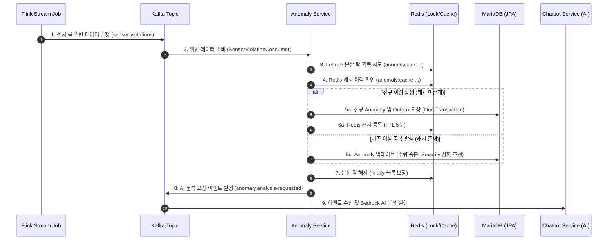

# SIGMA 스마트 팩토리 이상 탐지 및 이벤트 제어 서비스 (Anomaly-Service)

이 프로젝트는 **Spring Boot** 기반의 마이크로서비스로, 스마트 팩토리 실시간 공정 내 설비에서 감지된 센서 이상 징후(`Anomaly`)를 적재하고, 분산 환경에서의 동시성 제어 및 중복 억제(Deduplication)를 수행하며, 신뢰성 있는 이벤트 브로커 연동을 통해 전체 이벤트 파이프라인을 조율하는 서비스입니다.

특히 Flink 실시간 스트림 위반 이벤트 유입에 대응하는 **Lettuce 기반 분산 락**, **동적 심각도 업그레이드(Dynamic Severity Upgrade) 정책**, **Transactional Outbox 패턴**, 그리고 **AI 비동기 분석 컨텍스트 파이프라인**을 통합 제공합니다.

---

## 아키텍처 및 시스템 흐름도

공정 내 센서 데이터가 실시간으로 수집되어 최종 AI 분석 결과가 챗봇에 전달되기까지의 흐름입니다.



---

## 프로젝트 구조

```text
src/main/java/com/factory/anomaly/
  ├── config/              # Redis (Lettuce), QueryDSL, JPA, Kafka 등 아키텍처 설정
  ├── controller/          # REST API 엔드포인트 (이상 로그 조회, 수동 AI 분석 트리거)
  ├── domain/              # DTO, Enum (Severity, AnomalyType, AnalysisStatus 등)
  ├── event/               # Kafka 이벤트 페이로드 및 Outbox 이벤트 리스너
  │   ├── handler/         # Outbox 테이블의 이벤트를 Kafka로 발행하는 핸들러
  │   └── payload/         # AnalysisRequestedPayload, AnomalyCreatedPayload
  ├── exception/           # 비즈니스 예외 처리 및 글로벌 익셉션 핸들러
  ├── infrastructure/      # 데이터 액세스 및 외부 연동 레이어
  │   ├── entity/          # Anomaly, OutboxEvent, EquipmentInfo 등 JPA 엔티티
  │   ├── querydsl/        # AnomalyRepositorySupport (QueryDSL 동적 쿼리 구현)
  │   └── redis/           # SensorRedisRepository (Lettuce 락/캐시 제어)
  └── service/             # 비즈니스 로직
      ├── AnomalyDetectionService.java # Flink 유입 이벤트 파이프라인 처리
      └── AnomalyService.java          # Anomaly 조회 및 AI 분석 트리거 관리

src/main/resources/
  ├── application.yml      # 기본 및 환경별 Profile 설정
  └── db/migration/        # Flyway DB 마이그레이션 스크립트 (스키마 정의)
```

---

## 핵심 기술 및 구현 상세

### 1. Flink 실시간 스트림 연동 (`SensorViolationConsumer`)

Flink 분석 엔진은 1분/1초 단위 슬라이딩 윈도우 내에서 설정된 임계치를 벗어난 센서 데이터를 위반 이벤트로 발행합니다.

`SensorViolationConsumer`는 `sensor-violations` 토픽의 이벤트를 실시간으로 소비하고, 수신된 이상 신호를 비즈니스 검증 레이어로 전달합니다.

---

### 2. Lettuce 기반 분산 락 및 캐시 중복 억제

고주파 스트림 환경에서 동일 설비의 동일 센서 이상 이벤트가 동시다발적으로 유입될 경우, 여러 Consumer Thread가 동시에 DB 조회 및 Insert를 수행하면서 동일 이상 로그가 중복 생성될 수 있습니다.

이를 방지하기 위해 Redis 기반 분산 락과 캐시 중복 억제 메커니즘을 결합했습니다.

#### 동시성 제어

Redisson 대신 Lettuce의 `setIfAbsent`를 활용하여 경량화된 분산 락을 구현했습니다.

* Lock Key 포맷

```text
anomaly:lock:{equipmentCode}:{parameterName}:{ruleName}:{anomalyType}
```

* 락 획득 실패 시 50ms 간격으로 재시도
* 최대 Lock TTL 5초를 설정하여 데드락 방지
* `try-finally` 구조를 통해 트랜잭션 성공/실패 여부와 관계없이 락 해제 보장

#### 캐시 중복 억제

락 획득 후에는 동일 이상 조건에 대한 캐시를 조회합니다.

* Cache Key 포맷

```text
anomaly:cache:{equipmentCode}:{parameterName}:{ruleName}:{anomalyType}
```

캐시가 존재하는 경우 신규 DB Insert를 생략하고, 기존 Anomaly 엔티티의 누적 카운트와 최종 탐지 시각을 갱신합니다.

#### 동적 심각도 업그레이드

동일 이상 조건이 반복 유입되는 과정에서 새로 유입된 이벤트의 심각도가 기존 값보다 높은 경우, 기존 이상 로그의 severity를 상향 조정합니다.

예시는 다음과 같습니다.

```text
INFO -> WARNING -> CRITICAL
```

---

### 3. Transactional Outbox 패턴을 통한 메시지 신뢰성 보강

데이터베이스 수정과 Kafka 이벤트 발행 사이의 이중 쓰기(Dual Write) 문제를 줄이기 위해 Transactional Outbox 패턴을 적용했습니다.

이상 로그가 DB에 저장될 때, Outbox 엔티티(`OutboxEvent`)도 동일 트랜잭션 내에 함께 저장됩니다. 이후 트랜잭션 커밋이 완료된 시점에 Kafka 이벤트를 발행하고, 발행 상태를 Outbox 레코드에 반영하여 이벤트 전송 상태를 추적합니다.

이를 통해 DB 저장과 이벤트 발행 간 정합성을 높이고, 이벤트 발행 실패 시에도 재처리 가능한 구조를 제공합니다.

---

### 4. AI 비동기 분석 컨텍스트 파이프라인 설계

`chatbot-service` 내부의 AWS Bedrock LLM이 스마트 팩토리 데이터를 분석할 수 있도록, 이상 탐지 및 수동 요청 시점에 필요한 컨텍스트 정보를 이벤트로 전달합니다.

연동되는 주요 필드는 다음과 같습니다.

1. `sampleCount`: 이상 탐지 누적 횟수
2. `lastDetectedAt`: 최종 이상 탐지 시각
3. `severity`: 최종 조정된 심각도 등급
4. `ruleType`: 적용된 비즈니스 룰 분류

해당 메타데이터는 `AnalysisRequestedPayload`를 통해 챗봇 서비스의 Bedrock 프롬프트에 주입되며, 이상 원인 분석 및 조치 제안에 활용됩니다.

---

## REST API 명세

### 1. 이상 로그 목록 조회

QueryDSL 기반 동적 필터 및 페이징을 지원합니다.

#### Request

```http
GET /api/anomalies?processId=1&equipmentId=2&keyword=Temperature&page=0&size=10
```

#### Response

```json
{
  "success": true,
  "status": 200,
  "message": "success",
  "data": {
    "content": [
      {
        "anomalyId": 124,
        "equipmentId": 2,
        "equipmentName": "EQP-DEPOSITION-001",
        "parameterName": "Soft Bake Temperature",
        "ruleName": "Temp Limit Exceeded",
        "anomalyType": "OUT_OF_BOUNDS",
        "severity": "CRITICAL",
        "sampleCount": 42,
        "firstDetectedAt": "2026-06-11T04:10:00",
        "lastDetectedAt": "2026-06-11T04:22:15",
        "analysisStatus": "SUCCESS"
      }
    ],
    "pageable": {
      "pageNumber": 0,
      "pageSize": 10,
      "totalElements": 1,
      "totalPages": 1
    }
  },
  "timestamp": "2026-06-11T04:23:00.124"
}
```

---

### 2. 이상 로그 상세 및 AI 분석 결과 조회

#### Request

```http
GET /api/anomalies/124
```

#### Response

```json
{
  "success": true,
  "status": 200,
  "message": "success",
  "data": {
    "anomalyId": 124,
    "equipmentId": 2,
    "equipmentName": "EQP-DEPOSITION-001",
    "parameterName": "Soft Bake Temperature",
    "ruleName": "Temp Limit Exceeded",
    "anomalyType": "OUT_OF_BOUNDS",
    "severity": "CRITICAL",
    "sampleCount": 42,
    "analysisStatus": "SUCCESS",
    "aiReport": {
      "reportId": 89,
      "summary": "Soft Bake 공정 중 온도가 허용 임계치(110°C)를 초과하여 CRITICAL 등급 이상이 42회 누적 발생했습니다. 히스토리 분석 결과, 히터 단선의 징후가 보이며 Spin Speed와의 상관계수가 높아 불량 유발 확률이 높습니다.",
      "recommendation": "1. 히터 센서 정밀 캘리브레이션 실행\n2. 온도를 105°C 이하로 즉시 억제하고 스핀 속도를 2200 RPM 수준으로 유지 조치 권장",
      "generatedAt": "2026-06-11T04:23:05"
    }
  },
  "timestamp": "2026-06-11T04:23:10.552"
}
```

---

### 3. AI 분석 수동 재수행 요청

#### Request

```http
POST /api/anomalies/124/analyze
Content-Type: application/json

{
  "focusArea": "HEATER_UNIT",
  "hints": "최근 3일간의 동일 모델 캘리브레이션 이력 반영 요망"
}
```

#### Response

```json
{
  "success": true,
  "status": 202,
  "message": "AI analysis task requested successfully",
  "data": {
    "anomalyId": 124,
    "analysisStatus": "RUNNING"
  },
  "timestamp": "2026-06-11T04:24:01.002"
}
```

---

### 4. 설비별 이상 발생 건수 조회

내부 배치 통계용 API입니다.

#### Request

```http
GET /api/anomalies/count?equipmentName=EQP-DEPOSITION-001&since=2026-06-11T00:00:00
```

#### Response

```json
{
  "success": true,
  "status": 200,
  "message": "success",
  "data": {
    "equipmentName": "EQP-DEPOSITION-001",
    "count": 14,
    "since": "2026-06-11T00:00:00"
  },
  "timestamp": "2026-06-11T04:24:15.918"
}
```

---

## 검증 및 멀티스레드 동시성 테스트

분산 락과 중복 제거 로직이 멀티스레드 환경에서 올바르게 동작하는지 검증하기 위해 JUnit 동시성 테스트를 수행합니다.

### 검증 시나리오 (`AnomalyDetectionServiceTest`)

* 동일 설비 및 센서에 대한 이상 징후 위반 이벤트 4개가 동시에 유입되는 상황을 모사
* `ExecutorService`를 활용해 4개의 독립 스레드에서 `AnomalyDetectionService.detect()` 병렬 호출
* `CountDownLatch`를 사용하여 스레드들이 동시에 실행을 시작하도록 임계점 설정
* DB 내 Anomaly 레코드가 1개만 신규 삽입되는지 검증
* 나머지 호출이 기존 레코드의 누적 카운트를 갱신하는지 검증
* 최종 `sampleCount` 값이 4가 되는지 확인

### 테스트 명령어

```bash
./gradlew test --tests "com.factory.anomaly.service.AnomalyDetectionServiceTest"
```

---

## 환경 변수 및 설정

로컬 및 배포 환경에서 구동하기 위해 필요한 환경 변수 목록입니다.

보안 강화를 위해 실제 자격 증명은 README에 기술하지 않으며, 루트 디렉토리의 `.env.example` 파일을 참고하여 `.env` 파일을 생성해 사용합니다.

| 환경 변수명                    | 설명                               | 예시 / 기본값                                   |
| :------------------------ | :------------------------------- | :----------------------------------------- |
| `DB_URL`                  | 데이터베이스 연결 URL (MariaDB/MySQL 호환) | `jdbc:mariadb://localhost:3306/anomaly_db` |
| `DB_USERNAME`             | 데이터베이스 접속 계정명                    | `your_db_user`                             |
| `DB_PASSWORD`             | 데이터베이스 접속 패스워드                   | `your_db_password`                         |
| `DB_MAX_POOL_SIZE`        | HikariCP 최대 커넥션 풀 크기             | `10`                                       |
| `DB_MIN_IDLE`             | HikariCP 최소 유휴 커넥션 수             | `5`                                        |
| `REDIS_HOST`              | Redis 호스트 주소 (Lettuce 분산 락/캐시용)  | `localhost`                                |
| `REDIS_PORT`              | Redis 포트 번호                      | `6379`                                     |
| `KAFKA_BOOTSTRAP_SERVERS` | Apache Kafka 브로커 주소              | `localhost:9092`                           |
| `VIOLATION_TOPIC`         | Flink 룰 위반 이벤트 수신 Kafka 토픽명      | `sensor-violations`                        |
| `VIOLATION_GROUP_ID`      | Kafka 컨슈머 그룹 ID                  | `anomaly-violation-group`                  |

---

## 로컬 실행 방법

### 1. 의존성 및 빌드 검증

```bash
./gradlew clean build -x test
```

### 2. 로컬 실행

```bash
./gradlew bootRun
```
